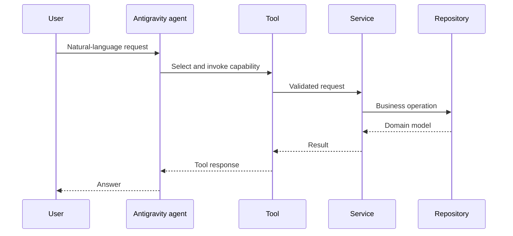

# Antigravity SDK Handbook

This handbook is the entry point to the project’s chapter-based SDK learning guide. SDK APIs and package names can change, so implementation work must be checked against the installed version and its official reference.

## Chapters

1. [Introduction](01-introduction.md)
2. [Runtime](02-runtime.md)
3. [Agents](03-agents.md)
4. [Tools](04-tools.md)
5. [Conversations](05-conversations.md)
6. [Policies and system instructions](06-policies.md)
7. [Hooks](07-hooks.md) — planned
8. [Triggers](08-triggers.md) — planned
9. [MCP](09-mcp.md) — planned
10. [Best practices](10-best-practices.md)

## Responsibility boundary

The SDK powers the agent runtime: prompt handling, tool selection, invocation, and response generation. It is not the home for ERP business rules, direct data access, credentials, or persistence.

## Project integration pattern

1. Load settings and secrets outside source control.
2. Build the agent during application startup.
3. Register tools with precise descriptions and input contracts.
4. Delegate from every tool to a service.
5. Keep runtime errors observable without exposing secrets or raw backend responses.

## Tool design checklist

- Describe the business capability in language useful to the model.
- Validate only interface-level input in the tool.
- Put policy, workflow, and domain validation in a service.
- Return a stable, user-safe result.
- Test the service separately from SDK integration.

## Lifecycle and configuration

The documented structure separates the CLI/application entry point, configuration, settings, prompts, and assistant construction. See [ADR 0003](../adr/0003-interactive-cli-and-composition.md) and the [agent lifecycle](../architecture/agent-lifecycle.md).

## Safe evolution

When upgrading the SDK, first confirm supported setup, agent, and tool APIs in the version actually installed. Then run the application’s focused agent/tool tests, verify an interactive request, and update this handbook plus affected ADRs or journals.

## Revision history

| Date | Change |
| --- | --- |
| 2026-08-04 | Created project-specific SDK integration guide. |

---

Back to the [documentation index](../index.md) · Next: [ERPNext handbook](../erpnext/handbook.md)
