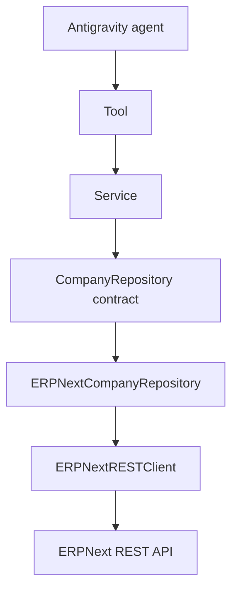

# ERPNext REST Integration Architecture

Sprint 5.1 and 5.2 establish the first operational integration slice: read Company information through ERPNext REST while preserving the existing Tool and Service path.

## Implemented boundary

The client owns `requests.Session`, token authentication headers, URL construction, GET execution, JSON parsing, timeout, and HTTP error conversion. The REST repository owns Company lookup and mapping, not HTTP mechanics.

## Configuration

| Variable | Purpose |
| --- | --- |
| `ERPNEXT_URL` | Enables the REST-backed Company repository and supplies its base URL. |
| `ERPNEXT_API_KEY` / `ERPNEXT_API_SECRET` | Supply ERPNext token credentials. Do not commit them. |

## Security and error behavior

Use least-privilege credentials and keep secrets out of source control and diagnostics. The integration distinguishes authentication/authorization (401/403), not found (404), validation (400/417), timeout, connection, and unexpected response/JSON errors through `ERPNextError` subclasses.

## Remaining Sprint 5 work

- Migrate other entity repositories only after their contracts and mappings are defined.
- Gather controlled live integration evidence rather than treating an environment-dependent skipped test as proof.
- Decide resilience features such as retries after concrete operation requirements are known.

## Future transport option

MCP is planned as an alternative integration route behind repository contracts. It is not part of Sprint 5’s runtime. Direct REST comes first to establish endpoint, authentication, mapping, and failure behavior under project control. See [ADR 0009](../adr/0009-rest-first-mcp-later.md).

## Observability

OpenTelemetry is intentionally deferred to Sprint 6. The REST client creates a single natural location for future outbound spans, but no tracer, exporter, or instrumentation package is currently installed or active. See [ADR 0010](../adr/0010-observability-deferred-to-sprint-6.md).

## Revision history

| Date | Change |
| --- | --- |
| 2026-08-06 | Replaced planned design with implemented Sprint 5.1–5.2 boundary and remaining scope. |

---

Previous: [Repository layer](repository-layer.md) · Back to the [documentation index](../index.md).
