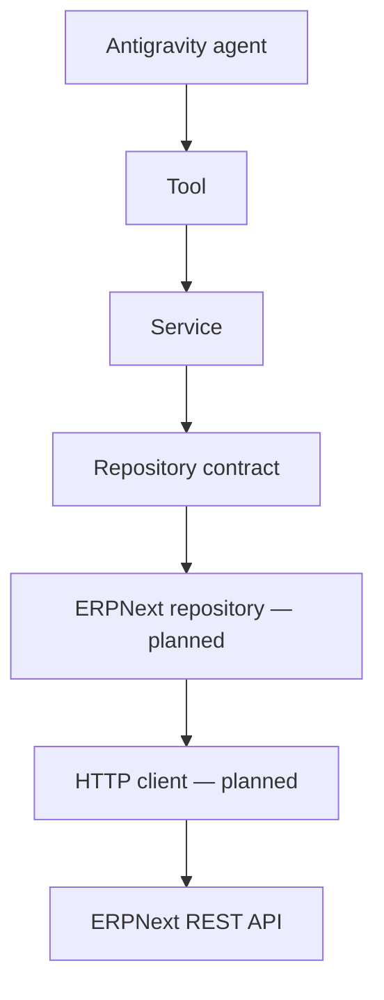

# Future ERPNext Integration Architecture

## Purpose

This document defines the architectural boundary for Sprint 5. It describes the intended integration shape and acceptance evidence; it does not claim that a live ERPNext connection exists.

## Target design

The tool and service contracts must remain unchanged when mock repositories are replaced. The ERPNext repository owns request construction, response mapping, transport failures, and conversion to domain errors. Services remain responsible for business policy; tools remain responsible for model-facing input and output.

## Integration rules

- Store endpoints and secrets outside source control.
- Use explicit timeouts and bounded retries only where an operation is safe to retry.
- Never log authorization headers, tokens, or full sensitive payloads.
- Convert external response shapes into domain models at the repository boundary.
- Distinguish authentication, authorization, validation, missing-record, transport, and unexpected-response errors.
- Start with least-privilege, read-only access and controlled test data.

## Completion evidence

Sprint 5 cannot be marked complete until the project has an approved authentication decision, a configured client, repository mapping tests, controlled integration-test evidence, user-safe error handling, and updated delivery documentation.

## Related documents

- [ERPNext integration handbook](../erpnext/handbook.md)
- [Repository layer](repository-layer.md)
- [ADR index](../adr/index.md)
- [Sprint 5 roadmap](../project-roadmap.md)

## Revision history

| Date | Change |
| --- | --- |
| 2026-08-04 | Added the planned ERPNext integration architecture boundary. |

---

Previous: [Repository layer](repository-layer.md) · Back to the [documentation index](../index.md)
