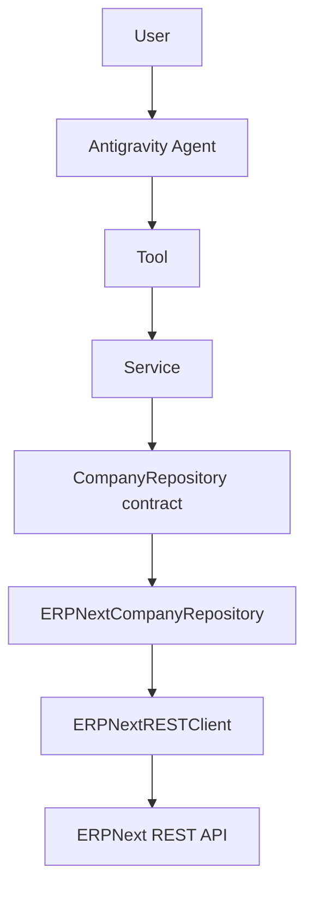
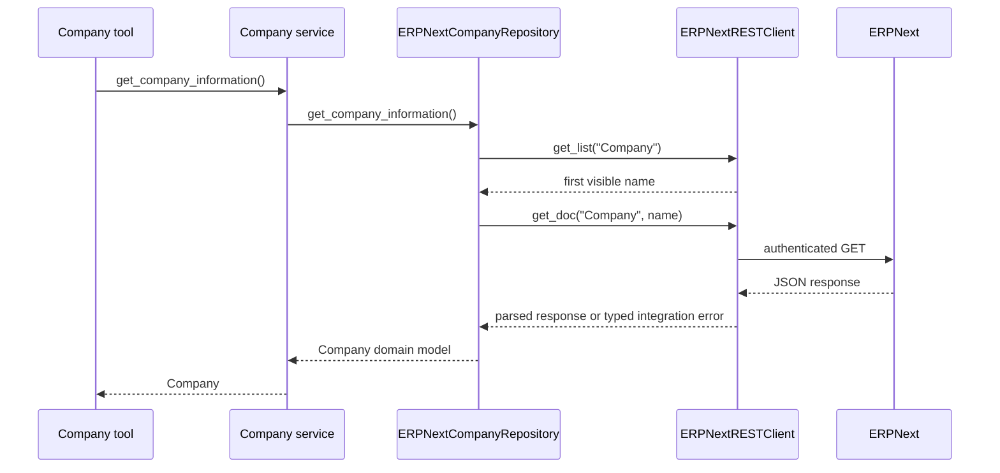

# Architecture Overview

Sprint 5 has introduced the first live ERPNext integration path without changing the Agent, Tool, or Service contracts. The Company path is now always backed by the ERPNext REST repository.

## Current dependency flow

`get_company_repository()` always constructs `ERPNextCompanyRepository`, memoizing the instance for reuse within the process.

## Layer responsibilities

| Layer | Current responsibility |
| --- | --- |
| `app.py` / `config.py` | Compose and start the application and Agent runtime. |
| `tools/` | Provide model-facing functions and format responses. |
| `services/` | Coordinate application capabilities and return domain objects. |
| `repositories/` | Define entity-level contracts, choose/make data access implementations, and map ERPNext data into domain models. |
| `clients/` | Own HTTP details: session, authentication header, URL construction, timeout, response parsing, and transport error translation. |
| `models/` | Represent application domain objects such as `Company`. |

The client does not know business entities. Conversely, repositories do not construct URLs or call `requests` directly.

## Company REST request walkthrough

The REST client uses one `requests.Session`, sets `Authorization: token <key>:<secret>` and `Accept: application/json` once, then maps timeout, connection, authentication/authorization, missing-resource, validation, and unexpected-response cases to project exceptions. It also supports `with ERPNextRESTClient() as client:` for explicit session cleanup.

## Dependency injection and testing

`ERPNextCompanyRepository` accepts an optional `ERPNextRESTClient` and optional company name. Tests inject a fake client, which validates JSON-to-domain mapping and fallback selection without a network connection. The client test suite separately verifies session reuse and URL construction; its live connectivity check skips unless `ERPNEXT_URL` is configured.

## Boundaries and current limits

- The Company repository is the only REST-backed repository currently implemented. Customer data remains mock-backed.
- There is no generic repository factory yet; the Company module owns its temporary selection logic.
- Retries, write methods, structured logging, metrics, and tracing are outside current implementation scope.
- `fiscal_year` and `industry` are not Company DocType fields in the current mapping, so missing values are represented as `Not tracked on Company in ERPNext`.

## Future evolution

MCP is a planned alternative transport, not a dependency of the current path. A future MCP-backed repository/client must satisfy the existing repository-facing capability without requiring Service or Tool changes. See [ADR 0009](../adr/0009-rest-first-mcp-later.md).

OpenTelemetry was evaluated during Sprint 5 and deferred to Sprint 6. The new client boundary is the preferred initial instrumentation point because it centralizes outbound ERPNext calls. See [ADR 0010](../adr/0010-observability-deferred-to-sprint-6.md).

## Related documentation

- [Layered architecture](layered-architecture.md)
- [Repository layer](repository-layer.md)
- [ERPNext REST integration architecture](future-erpnext.md)
- [Sprint 5 journal](../journal/sprint-05-erpnext-rest-foundation.md)

## Revision history

| Date | Change |
| --- | --- |
| 2026-08-06 | Replaced Sprint 4 planning-era architecture with the implemented Sprint 5.1–5.2 design. |

---

Back to the [documentation index](../index.md).
