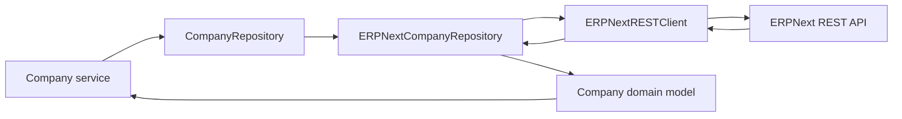

# Repository Layer

Repositories are the entity-oriented data boundary. They return domain models to services and hide ERPNext's REST details from the rest of the app.

## Company contract and implementations

```python
class CompanyRepository(ABC):
    @abstractmethod
    def get_company_information(self) -> Company:
        ...
```

| Implementation | Responsibility |
| --- | --- |
| `ERPNextCompanyRepository` | Retrieves a Company through the REST client and maps it to `Company`. |

The current composition helper is local to `company_repository.py`: `_create_repository()` makes the selection once at module initialization. This is sufficient for one migrated capability, but a dedicated factory is a future improvement once multiple implementations need selection.

## Mapping and delegation

`ERPNextCompanyRepository` delegates all transport work to `ERPNextRESTClient`:

- Call `get_list("Company")`, select the first visible Company, then fetch that document with `get_doc("Company", name)`.
- Convert the returned `data` object to `Company` using `company_name` (or `name`), `country`, and `default_currency`.
- Preserve the explicit placeholder for `fiscal_year` and `industry`, which are not sourced from the Company DocType in this increment.



## Error boundary

The REST client raises `ERPNextError` subtypes for connection, timeout, authentication, missing resource, validation, and unexpected response failures. The current Company repository does not collapse these errors: it retains the precise integration failure for an upper layer to present safely in a later increment.

## What repositories do not own

- Tool formatting or agent interactions
- URL construction, headers, sessions, JSON decoding, or direct `requests` usage
- Service-layer business policy
- Logging or tracing configuration

## Verification

Repository tests inject `FakeERPNextRESTClient`. They confirm the REST implementation satisfies the abstract contract, maps an ERPNext document into `Company`, and falls back to the first visible Company when no configured name is supplied. This keeps unit tests independent of a running ERPNext instance.

## Related documentation

- [Architecture overview](overview.md)
- [Client-layer ADR](../adr/0008-client-layer.md)
- [Repository-abstraction ADR](../adr/0006-repository-abstraction.md)
- [Sprint 5 journal](../journal/sprint-05-erpnext-rest-foundation.md)

## Revision history

| Date | Change |
| --- | --- |
| 2026-08-06 | Rewrote the page to reflect the implemented Company repository contract and REST adapter. |

---

Back to the [documentation index](../index.md).
