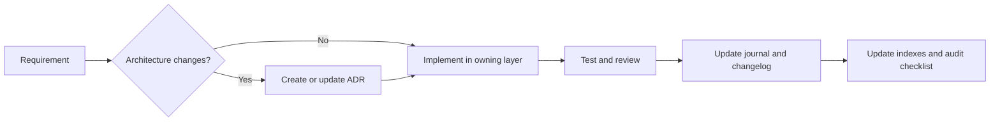

# Development Handbook

This handbook turns the documented architecture into a working contribution path. It reflects the implemented Sprint 5.1–5.2 client and Company-repository boundary; remaining integration work remains planned.

## Chapters

- [Coding standards](coding-standards.md)
- [Branching strategy](branching-strategy.md)
- [Review process](review-process.md)
- [Definition of done](definition-of-done.md)
- [Documentation process](documentation-process.md)

## Local workflow

1. Read the [roadmap](../project-roadmap.md), relevant ADRs, and the closest architecture page.
2. Make the smallest coherent change within the appropriate layer.
3. Add or update tests appropriate to the change.
4. Update the changelog and documentation records in the same change set.
5. Review links, status labels, and planned-vs-current statements.

## Layer ownership

| Layer | Owns | Must not own |
| --- | --- | --- |
| Application/agent | Startup and conversation orchestration | ERP policy and data access |
| Tool | Model-facing input/output translation | Workflows and transport calls |
| Service | Business rules and coordination | SDK-specific code and raw HTTP |
| Repository | Entity data retrieval/persistence and mapping | Presentation formatting and raw HTTP |
| Client | HTTP session, authentication headers, timeouts, parsing, transport errors | Entity mapping and business policy |
| Model | Domain representation | SDK or transport dependencies |

## Change flow

## Test expectations

Prefer focused unit tests for services, repository mapping, and error paths. SDK/tool tests should exercise registration and one representative invocation without placing business-rule coverage exclusively in agent-level tests. Future ERPNext work also requires controlled integration tests.

## Documentation completion

Follow the [style guide](../documentation-style-guide.md). A completed sprint needs a journal, any required ADR, updated architecture material, changelog entry, and index/README links. Do not mark a planned capability complete before test or runtime evidence exists.

## Revision history

| Date | Change |
| --- | --- |
| 2026-08-04 | Created contribution workflow aligned to the documented architecture. |
| 2026-08-06 | Added the Sprint 5 client-layer boundary. |

---

Back to the [documentation index](../index.md) · Next: [Style guide](../documentation-style-guide.md)
