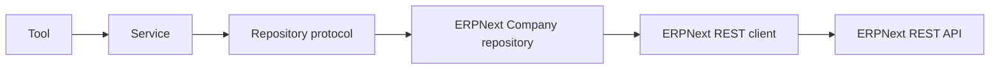

# ERPNext Integration Handbook

ERPNext REST integration is in progress. Sprint 5.1 and 5.2 implement the client boundary, token-based configuration, typed error model, and a REST-backed Company repository. The remaining work is deliberately tracked as remaining scope rather than treated as complete.

## Chapters

- [Overview](overview.md)
- [Integration roadmap](roadmap.md)
- [Future integration requirements](future-integration.md)

## Target boundary

Only the planned adapter/client knows ERPNext request and response details. The service works with domain models and domain errors.

## Implementation checklist

- Confirm the target ERPNext version and endpoint contracts before expanding beyond Company.
- Gather controlled live integration evidence for the implemented Company path.
- Add further entity mappings with unit tests using mocked transport.
- Define authorization checks in the service/domain layer and honour backend permissions.
- Consider resilience and observability after the first transport path is stable.

## Error and security rules

Never log API secrets or raw credential headers. Distinguish unavailable transport, authentication/authorization failure, missing records, validation failure, and unexpected backend responses. Return safe messages at the tool boundary while preserving diagnostic detail for authorized logs.

## Data mapping

Repositories should translate API payloads into the project’s domain models. This prevents ERPNext-specific field names and response shapes from leaking into tools or services. See the [repository layer](../architecture/repository-layer.md) and [ADR 0004](../adr/0004-layered-service-repository-design.md).

## Completion evidence

Sprint 5 should not be marked complete until its remaining repository, controlled integration-test, and delivery evidence are complete. The implemented Company slice is recorded in the [Sprint 5 journal](../journal/sprint-05-erpnext-rest-foundation.md).

## Revision history

| Date | Change |
| --- | --- |
| 2026-08-04 | Created planned-integration guide from the roadmap and repository design. |
| 2026-08-06 | Updated the handbook for the completed Sprint 5.1–5.2 foundation. |

---

Previous: [Antigravity SDK handbook](../antigravity-sdk/handbook.md) · Back to the [documentation index](../index.md)
