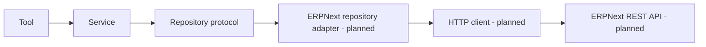

# ERPNext Integration Handbook

ERPNext REST integration is planned, not complete. This handbook defines the boundary and implementation checklist for the future repository adapter without claiming an endpoint, authentication mechanism, or permission model has already been implemented.

## Chapters

- [Overview](overview.md)
- [Integration roadmap](roadmap.md)
- [Future integration requirements](future-integration.md)

## Target boundary

Only the planned adapter/client knows ERPNext request and response details. The service works with domain models and domain errors.

## Implementation checklist

- Confirm the target ERPNext version, required DocTypes, and endpoint contracts.
- Choose and document the approved authentication mechanism and secret storage.
- Implement a narrowly scoped HTTP client with timeouts, safe logging, and structured errors.
- Map external payloads to domain models at the repository boundary.
- Define authorization checks in the service/domain layer and honour backend permissions.
- Add unit tests with mocked transport and integration tests against a controlled instance.
- Update the relevant ADR, Sprint 5 journal, changelog, architecture pages, and audit.

## Error and security rules

Never log API secrets or raw credential headers. Distinguish unavailable transport, authentication/authorization failure, missing records, validation failure, and unexpected backend responses. Return safe messages at the tool boundary while preserving diagnostic detail for authorized logs.

## Data mapping

Repositories should translate API payloads into the project’s domain models. This prevents ERPNext-specific field names and response shapes from leaking into tools or services. See the [repository layer](../architecture/repository-layer.md) and [ADR 0004](../adr/0004-layered-service-repository-design.md).

## Completion evidence

Sprint 5 should not be marked complete until a real repository adapter, documented configuration, error model, tests, and an updated sprint journal exist.

## Revision history

| Date | Change |
| --- | --- |
| 2026-08-04 | Created planned-integration guide from the roadmap and repository design. |

---

Previous: [Antigravity SDK handbook](../antigravity-sdk/handbook.md) · Back to the [documentation index](../index.md)
