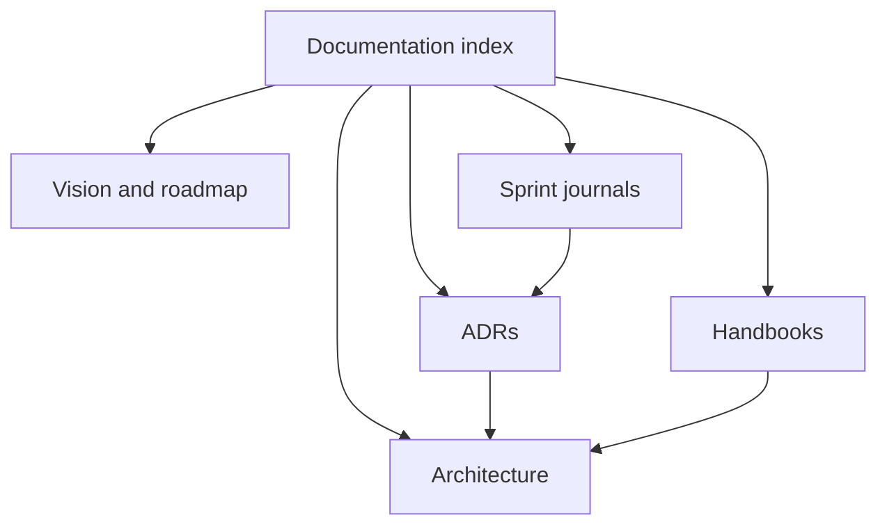

# Documentation Index

This is the entry point for ERPNextAgent documentation. The repository is currently documented through **Sprint 4**; material for later sprints is planning guidance, not an implementation record.

## Start here

- [Project vision](project-vision.md) and [roadmap](project-roadmap.md)
- [Learning path](learning-path.md)
- [Architecture overview](architecture/overview.md)
- [Development handbook](development/development-handbook.md)

## Architecture

- [Layered architecture](architecture/layered-architecture.md)
- [Agent lifecycle](architecture/agent-lifecycle.md)
- [Tools execution](architecture/tools-execution.md)
- [Service layer](architecture/services-layer.md)
- [Repository layer](architecture/repository-layer.md)
- [Future ERPNext integration architecture](architecture/future-erpnext.md)

## Decision and delivery records

- [ADR index](adr/index.md)
- [Sprint journal index](journal/index.md)
- [Changelog](../CHANGELOG.md)

## Integration handbooks

- [Antigravity SDK handbook](antigravity-sdk/handbook.md)
- [ERPNext handbook](erpnext/handbook.md)
- [Development handbook](development/development-handbook.md)

## Documentation governance

- [Documentation style guide](documentation-style-guide.md)
- [Glossary](glossary.md)
- [Documentation audit](documentation-audit-2026-08-04.md)

## Documentation map

## Revision history

| Date | Change |
| --- | --- |
| 2026-08-04 | Created documentation navigation and governance entry point. |

---

Next: [Project vision](project-vision.md) · [Style guide](documentation-style-guide.md)
