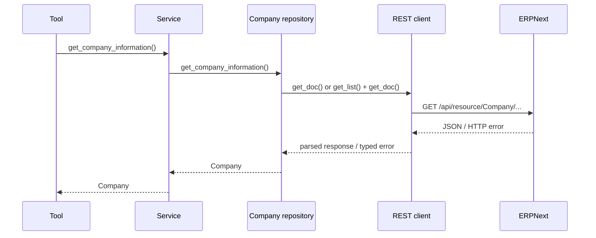

# Sprint 5 Journal — ERPNext REST Foundation

## Sprint goal

Validate the repository boundary against a real ERPNext transport without changing the Agent, Tool, or Service contracts. Sprint 5 is not complete; milestones 5.1–5.4 are complete and 5.5 is active.

## 5.1 — Integration boundary and configuration

### Delivered

- Created `clients/` and added `ERPNextRESTClient`.
- Added environment accessors for `ERPNEXT_URL`, `ERPNEXT_API_KEY`, `ERPNEXT_API_SECRET`, and optional `ERPNEXT_COMPANY`.
- Added a typed ERPNext exception hierarchy for connection, timeout, authentication, not-found, validation, and response failures.

### Architectural decision

HTTP transport is a separate client-layer concern. Repositories may understand ERPNext business entities and map their payloads, but they do not assemble URLs, manage a session, or decode HTTP responses. This is recorded in [ADR 0008](../adr/0008-client-layer.md).

## 5.2 — REST-backed Company repository

### Delivered

- Added the abstract `CompanyRepository` contract.
- Retained `MockCompanyRepository` as the safe default without `ERPNEXT_URL`.
- Added `ERPNextCompanyRepository`, which uses `ERPNextRESTClient` to obtain a Company document and maps it to the `Company` domain model.
- Added optional constructor injection of client and company name, enabling network-free unit tests.
- Added `get_doc()` and `get_list()` client helpers, one reusable `requests.Session`, token headers, a 10-second default timeout, response parsing, and context-manager cleanup.
- Added unit tests for client construction and repository mapping, plus an opt-in live connectivity check.

### Code walkthrough

1. The Company tool calls `company_service.get_company_information()` and formats the returned `Company`.
2. The service delegates to the Company repository module.
3. `_create_repository()` selects REST when `ERPNEXT_URL` is set, otherwise mock data.
4. `ERPNextCompanyRepository` uses `ERPNEXT_COMPANY`, or lists Companies to select the first visible name.
5. `ERPNextRESTClient` performs the authenticated GET and returns parsed JSON or a typed integration exception.
6. The repository maps `data` into `Company`; it explicitly marks fields not found on the Company DocType as not tracked.

### Request sequence

## 5.3–5.4 — Repository scaling

- Completed the REST-backed Company repository, repository factory, request logging, and REST-backed Customer lookup.

## 5.5 — REST-backed Item lookup

- Added the Item domain model, mock and REST repositories, service, and registered agent tool.
- Exact Item lookup falls back to a partial item-name search; unit tests cover mapping, fallback, no-match, and factory selection.
- The standard pytest command is now configured to resolve project imports.
- Controlled live verification remains pending until ERPNext is reachable.

## Lessons learned

- A small, entity-agnostic REST client keeps the repository concise and makes independent testing practical.
- Constructor injection is sufficient for the current single migrated repository; a shared repository factory should wait until there are multiple runtime choices.
- A configuration-dependent test that skips without ERPNext is a diagnostic aid, not end-to-end verification evidence.
- Repository abstraction protected higher layers as intended: the existing Company service and tool did not need transport-specific changes.

## Review notes

The implementation is a sound first integration slice. Review identified three scope boundaries that the documentation now makes explicit:

- Company and Customer are REST-backed; Item lookup is the active Sprint 5.5 milestone.
- There is no OpenTelemetry implementation or package yet.
- Retry policy, write operations, broader repository migration, and controlled integration-test evidence remain future work.

## OpenTelemetry evaluation and deferral

OpenTelemetry is appropriate for end-to-end traces, metrics, and transport timing, but adding it during the first REST slice would introduce cross-cutting configuration, exporters, and instrumentation before the path is stable. Sprint 6 will address observability deliberately, initially centered on the REST client. Conventional Python logging remains useful for startup and fatal diagnostics. See [ADR 0010](../adr/0010-observability-deferred-to-sprint-6.md).

## Related records

- [Architecture overview](../architecture/overview.md)
- [Client layer ADR](../adr/0008-client-layer.md)
- [Repository abstraction ADR](../adr/0006-repository-abstraction.md)
- [REST-first / MCP-later ADR](../adr/0009-rest-first-mcp-later.md)
- [Project roadmap](../project-roadmap.md)

## Revision history

| Date | Change |
| --- | --- |
| 2026-08-06 | Recorded completed Sprint 5.1 and 5.2 implementation, review, and deferrals. |

---

Previous: [Sprint 4](sprint-04-repository-pattern.md) · Back to the [journal index](index.md) · Next: [Roadmap](../project-roadmap.md)
