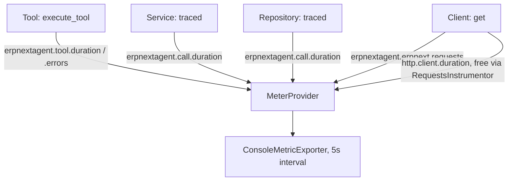

# Sprint 6 Journal — Observability

## Sprint goal

Give the application a structured, correlatable, inspectable observability stack — logging, tracing, then metrics — without changing the Agent/Tool/Service/Repository/Client contracts established in Sprints 1–5. Sprint 6 is not complete; milestones 6.1, 6.3, and 6.4 are done. This entry covers 6.4 in depth, per [ADR 0014](../adr/0014-opentelemetry-metrics.md)'s decision to write each sprint's journal as it ships rather than deferring it. Backfilling 6.1 and 6.3's journal sections is Sprint 6.5 scope, not a 6.4 blocker — see [ADR 0013](../adr/0013-tiered-definition-of-done-and-platform-hardening.md).

## 6.1 and 6.3 — pending backfill (Sprint 6.5)

Structured logging, correlation IDs ([ADR 0011](../adr/0011-structured-logging-and-correlation-ids.md)), and OpenTelemetry tracing ([ADR 0012](../adr/0012-opentelemetry-tracing.md)) are implemented, tested, and verified live — see those ADRs and the CHANGELOG for what shipped. Their full journal write-up (code walkthrough, sequence diagrams, lessons learned in this format) is scoped into Sprint 6.5.

## 6.4 — OpenTelemetry metrics

### Delivered

- Extended `observability/telemetry.configure_telemetry()` to also construct a `MeterProvider` (in addition to the existing `TracerProvider`), gated by the same `OTEL_ENABLED` flag — no new environment variable. Added `get_meter()`, mirroring `get_tracer()`.
- Extended the `traced()` decorator (ADR 0012) to record `erpnextagent.call.duration`, a Histogram with attributes `{operation, layer, outcome}`, alongside the span it already creates. `layer` is derived by a function extracted from `CorrelationFilter` (ADR 0011) into `observability.correlation.derive_layer()`, so logging and metrics classify the same module the same way instead of maintaining two copies of the same lookup table.
- Extended `utils.tool_execution.execute_tool()` (ADR 0011, Sprint 5.7) to record `erpnextagent.tool.duration` (Histogram, `{tool, outcome}`) and `erpnextagent.tool.errors` (Counter, `{tool, error_type}`), reusing its existing exception branches for the `error_type` value. The Tool name is recovered from the wrapped closure's `__qualname__` (e.g. `"get_customer.<locals>._get_customer"` → `"get_customer"`) rather than requiring every `tools/*.py` call site to pass it explicitly.
- Extended `clients/erpnext_rest_client.py`'s `get()` with an optional `doctype` parameter (passed from `get_doc()`/`get_list()`, which already know it) and a `erpnextagent.erpnext.requests` Counter, `{doctype, outcome}`.
- Verified that `opentelemetry-instrumentation-requests` (already installed for tracing in 6.3) automatically emits a `http.client.duration` histogram once a `MeterProvider` exists — no code change needed for generic HTTP request metrics. The custom `erpnextagent.erpnext.requests` counter is additive, not a duplicate: it carries the ERPNext `doctype` dimension the generic HTTP metric can't express.
- No new dependency: `opentelemetry.sdk.metrics` and `InMemoryMetricReader` were already available via the `opentelemetry-sdk` package installed in Sprint 6.3.

### Architectural decisions

All recorded in [ADR 0014](../adr/0014-opentelemetry-metrics.md): reuse existing auto-instrumentation instead of hand-rolling HTTP metrics; extend `traced()`/`execute_tool()` rather than add new mechanisms; an explicit, written cardinality rule (no free-form attribute values — ever); `erpnextagent.`-prefixed naming.

### Code walkthrough

1. `ERPNextRESTClient.get_doc("Item", "Desk")` calls `self.get(path, doctype="Item")`.
2. `get()` performs the request, then in a `finally` block increments `erpnextagent.erpnext.requests` with `{doctype: "Item", outcome}` regardless of which return/raise path was taken.
3. `ERPNextItemRepository.get_item()`, decorated `@traced()`, has its span and `erpnextagent.call.duration` (`{operation: "repositories.item_repository.ERPNextItemRepository.get_item", layer: "repository", outcome}`) recorded around the whole method body.
4. `ItemService.get_item()`, also `@traced()`, produces the same two signals with `layer: "service"`.
5. `tools/item.py`'s `get_item()` tool function calls `execute_tool(_get_item)`; `execute_tool()` records `erpnextagent.tool.duration` and, on failure, `erpnextagent.tool.errors`, tagged `tool: "get_item"`.

### Metrics data flow

### Verification

Live-verified with `OTEL_ENABLED=true`, including a forced flush to avoid waiting on the export interval: a real Item lookup and an intentionally invalid Customer lookup both produced all four expected metric families with correctly bounded attributes, and the generic `http.client.duration` metric appeared alongside the custom `erpnextagent.erpnext.requests` counter without duplicating it. Separately confirmed the disabled path (`OTEL_ENABLED=false`) produces no console metric or span output at all — the app behaves identically. The live run also surfaced a real, unrelated finding: the configured ERPNext credentials are currently being rejected with a 401 — flagged to the project owner, not a defect in this sprint's code.

### Testing

- `tests/conftest.py` now installs one shared, test-only `TracerProvider`/`MeterProvider` pair (backed by `InMemorySpanExporter`/`InMemoryMetricReader`) before any test module is collected, replacing the previous per-file setup in `test_observability_telemetry.py`. This removes a latent ordering fragility: OpenTelemetry's `set_tracer_provider()`/`set_meter_provider()` can only succeed once per process, so whichever test file happened to import first was implicitly deciding this for the whole suite. `conftest.py` is always imported first by pytest, so it no longer depends on file collection order.
- New tests in `test_observability_telemetry.py`, `test_tool_execution.py`, and `test_erpnext_rest_client.py` cover metric recording, attribute correctness (including the `outcome: "error"` path), and that `traced()`'s layer derivation agrees with `CorrelationFilter`'s.

## Lessons learned

- Checking what auto-instrumentation already provides, before writing custom instrumentation, avoided a redundant histogram for the same HTTP calls — worth doing before instrumenting any new library, not just this one.
- Extending existing chokepoints (`traced()`, `execute_tool()`, the REST client's `get()`) instead of adding parallel metrics-specific mechanisms kept this sprint's diff small and kept "where does layer X's signal get recorded" answerable in one place per layer.
- A shared `conftest.py` for OpenTelemetry test providers is worth doing early — it fixes an ordering hazard that would otherwise only surface as an intermittent, hard-to-explain test failure depending on collection order.
- Writing this journal alongside the sprint, per ADR 0013/0014, was noticeably easier than reconstructing it would have been afterward — the code walkthrough above was written while the code was still open, not recalled from memory.

## Related records

- [ADR 0010 — Defer OpenTelemetry to Sprint 6](../adr/0010-observability-deferred-to-sprint-6.md)
- [ADR 0011 — Structured Logging and Correlation IDs](../adr/0011-structured-logging-and-correlation-ids.md)
- [ADR 0012 — OpenTelemetry Tracing](../adr/0012-opentelemetry-tracing.md)
- [ADR 0013 — Tiered Definition of Done and Platform Hardening Before Sprint 7](../adr/0013-tiered-definition-of-done-and-platform-hardening.md)
- [ADR 0014 — OpenTelemetry Metrics](../adr/0014-opentelemetry-metrics.md)
- [Project checkpoint](../checkpoints/PROJECT_CHECKPOINT.md)
- [Project roadmap](../project-roadmap.md)

## Revision history

| Date | Change |
| --- | --- |
| 2026-08-07 | Recorded Sprint 6.4 (OpenTelemetry metrics) implementation, verification, and lessons learned. |

---

Previous: [Sprint 5](sprint-05-erpnext-rest-foundation.md) · Back to the [journal index](index.md) · Next: [Roadmap](../project-roadmap.md)
